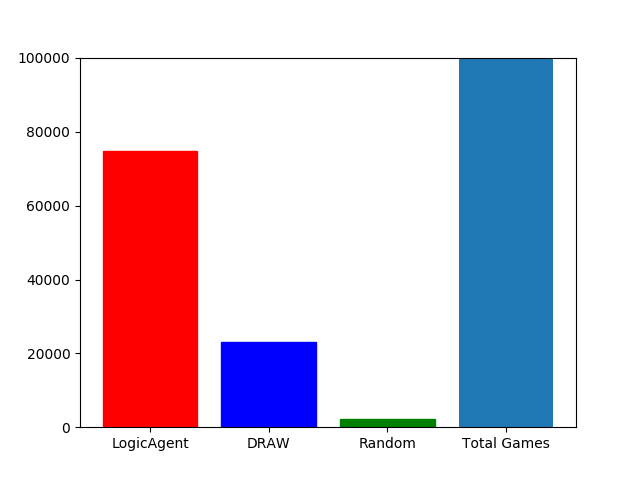
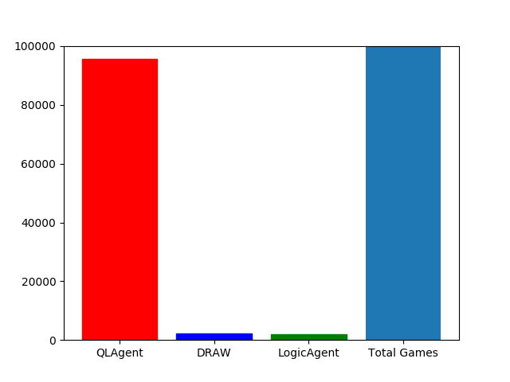
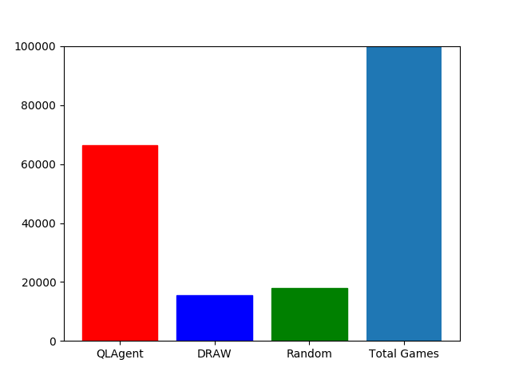
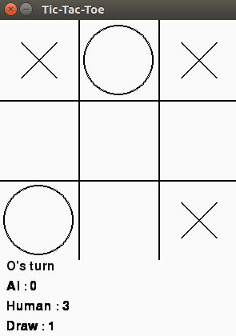

# QLearning tic-tac-toe Agent
In this project, we create a qlearning based tic-tac-toe agent to learn and play against pseudo logical AI, random agent and human players. The file `ttt_class.py` contains the code to create the Q Table for future references by playing against a pseudo logical agent.
In the file `ttt_performance_measure.py`, we can visualize the performance of our Q learning agent against a random agent or the pseudo logical agent using bar chart plots. In the file
 `ttt_human_vs_ai.py`, we have a very simplistic GUI based tictactoe game where we can play against the Q learning agent. The game is designed to keep count of the results of each game and restarts automatically once a game finishes. We can simply close the game
by clicking the `X` button on the window to close the game.

This project is essentially for educational and experimental purposes to see how reinforcement learning(specifically, QLearning) works in the classic game of tic tac toe.

## Installation:

```
$ git clone https://github.com/alishaz-polymath/tic-tac-toe.git
```

## Usage:

1. Run the `ttt_class.py` file to generate a newer version of `Qlearn_new.pickle` file, if you wish, else go to step 2.
2. Run the `ttt_performance_measure.py` file to visualise the performance index between various agents, which can be selected from within the file inside the `main()` definition. 
3. Run the `ttt_human_vs_ai.py` file to play against the Q Learning agent in with a simplistic GUI.

## Essential Libraries:
* numpy
* random
* matplotlib
* pickle
* pygame

## Example Performance Measure Graphs:






## Example Game Board:



## License:
This project is licensed under the MIT License.
